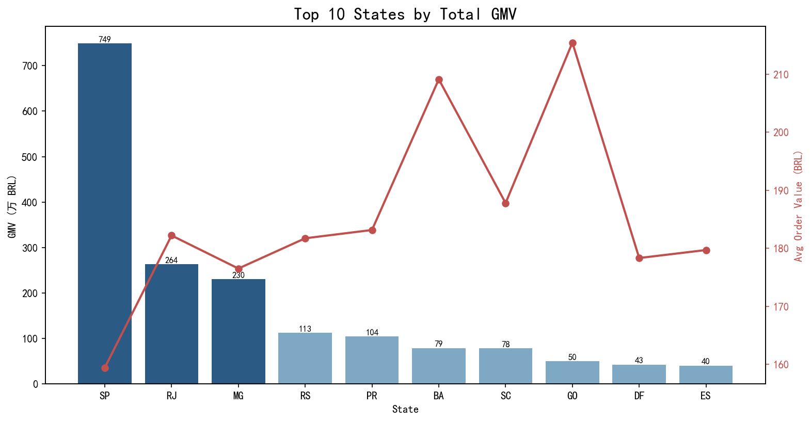
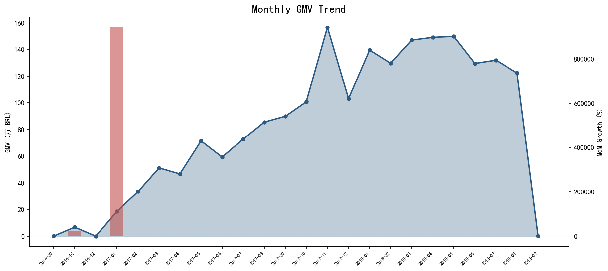
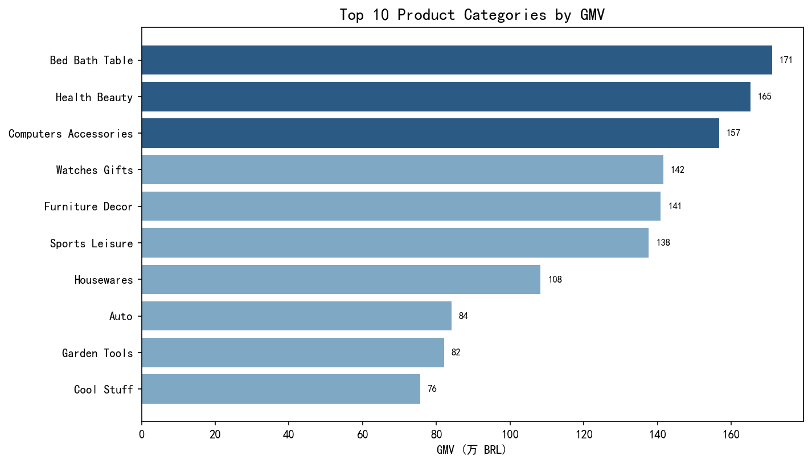
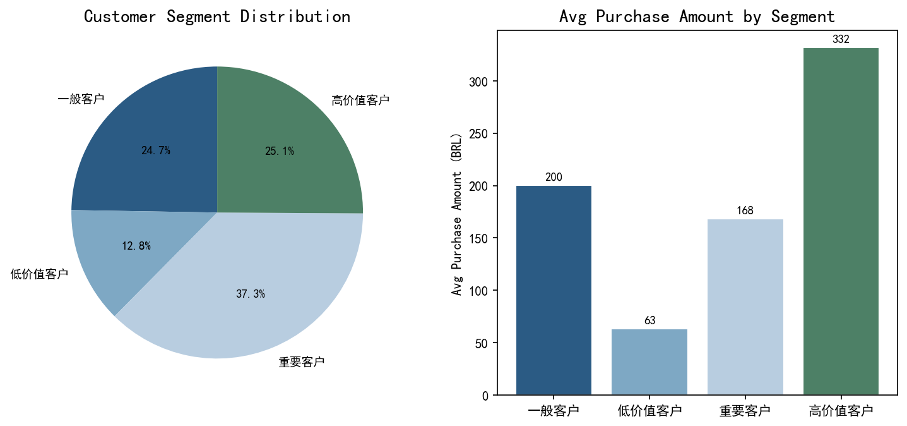

# 巴西电商数据分析（Brazilian E-Commerce Analysis）

基于 Kaggle 公开的巴西电商 Olist 数据集（约 10 万订单），使用 **PySpark** 完成多维度经营分析：从数据清洗、指标计算到 RFM 客户分层，最后用 matplotlib 输出可视化图表。

数据集：[Brazilian E-Commerce Public Dataset by Olist](https://www.kaggle.com/datasets/olistbr/brazilian-ecommerce)（下载后放入 `data/` 目录，数据不入库）

## 分析内容

| 模块 | 说明 |
|---|---|
| 数据清洗 | 金额类型转换、时间戳解析、过滤无效订单状态、支付金额按订单聚合 |
| 区域分析 | 各州 GMV / 订单量 / 客单价排名 |
| 趋势分析 | 月度 GMV 走势与环比增速 |
| 品类分析 | 商品类目 GMV 排名（葡语类目名翻译为英文） |
| RFM 分层 | 按最近消费、频次、金额将客户分为高价值 / 重要 / 一般 / 低价值四层 |

## 核心结论

- **区域高度集中**：圣保罗州（SP）GMV 约 749 万 BRL、4.1 万单，是第二名里约州（RJ，264 万）的近 3 倍，头部三州（SP/RJ/MG）贡献绝大部分营收
- **品类格局**：床品卫浴（bed_bath_table，171 万 BRL）、健康美妆（health_beauty，166 万）、电脑配件（computers_accessories，157 万）为 GMV 前三类目；手表礼品（watches_gifts）客单价最高（238 BRL）
- **增长趋势**：2017 年起月度 GMV 进入稳定增长通道，客单价维持在 160–200 BRL 区间
- **客户结构**：RFM 分层显示高价值客户（前 25%）约 2.46 万人，人均消费 332 BRL，是低价值客户（63 BRL）的 5 倍以上；整体复购率低（各层平均订单数均约为 1），拉新强、留存弱

## 成果展示

| 各州 GMV Top 10 | 月度趋势 |
|---|---|
|  |  |

| 品类排名 | RFM 客户分层 |
|---|---|
|  |  |

## 文件说明

| 文件 | 说明 |
|---|---|
| `analysis.py` | PySpark 分析主脚本（Spark SQL / DataFrame API），输出分析结果 CSV 到 `output/` |
| `visualize.py` | 读取分析结果，生成 4 张图表到 `output/charts/` |
| `data/` | 数据集（需自行从 Kaggle 下载，见上方链接） |
| `output/` | 分析结果 CSV 与图表成品 |

## 复现方式

```bash
pip install -r requirements.txt
# 从 Kaggle 下载数据集解压到 data/
python analysis.py    # PySpark 分析，生成本地 Spark 会话即可运行
python visualize.py   # 生成图表
```

## 工具

PySpark（Spark SQL / DataFrame API）· Pandas · Matplotlib

## License

MIT
